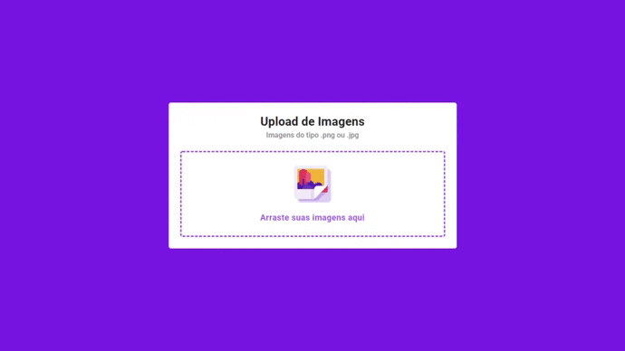
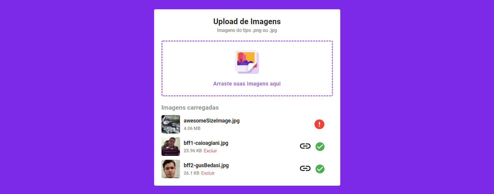

<h1 style="margin-top: 15px;" align="center">React.js Image Upload</h1>

Aplicação React com animações utilizando [Framer Motion](https://github.com/framer/motion) e drag & drop usando [React-Dropzone](https://github.com/react-dropzone/react-dropzone).

## Sobre

Essa aplicação é baseada no [vídeo](https://www.youtube.com/watch?v=G5UZmvkLWSQ) da [Rocketseat](https://github.com/Rocketseat) que por sua vez é a representa o front-end de um sistema de armazenamento de imagens localmente ou utilizando o serviço da [AWS S3](https://aws.amazon.com/pt/s3/). Essa é a minha versão da aplicação da Rocketseat e traz bibliotecas de animações como [Framer Motion](https://github.com/framer/motion) e [Lottie](https://github.com/airbnb/lottie-web) para melhorar a experiência do usuário.

Sendo assim o back-end já foi desenvolvido por mim também e está disponível [aqui](https://github.com/juan-patrick/nodejs-image-upload). Por sua vez se trata de uma API Rest que faz integração com a AWS e o LocalStorage do servidor usando o Multer.

## ✅ Instalação

### Pré-requisitos

- [Nodejs](https://nodejs.org) para rodar o servidor back-end.
- NPM ou [Yarn](yarnpkg.com) (recomendo ✌) para gerencia de pacotes
- [MongoDB](https://www.mongodb.com/) para armazenamento de informações das imagens que serão armazenadas. Pode ser uma conexão local ou uma conexão em Cloud como o [MongoDB Atlas](https://www.mongodb.com/cloud/atlas).
- (Opcional) Para upload de imagem no S3 da AWS será necessário ter uma [conta AWS](https://aws.amazon.com/pt/account/) ter algum bucket criado. Saiba mais sobre a [criação de bucket's](https://docs.aws.amazon.com/pt_br/AmazonS3/latest/user-guide/create-bucket.html).

Esse projeto depende de um back-end para rodar, então você precisa instalá-lo primeiro.

### Instalação do back-end
Recomendado criar uma pasta para guardar o back-end e o front-end.
  1. Realizar o clone do back-end usando o terminal: `git clone https://github.com/juan-patrick/nodejs-image-upload.git`
  2. Acessar a pasta do back-end: `cd nodejs-image-upload`.
  3. Instalar as dependências do projeto: `npm i` ou `yarn`
  4. Criar as variáveis no arquivo `.env`

### Configurando e entendendo o `.env`

As variáveis de ambiente são essenciais para essa aplicação, pois nela está armazenados dados sensíveis que não podem ficar disponíveis para qualquer pessoa. No caso dessa aplicação, algumas credenciais são de vital importância para o funcionamento da aplicação.

  - **APP_URL** é essencial, pois será usado pelo Multer e MongoDB para gravar o local das imagens caso seja armazenado localmente e refere-se ao endereço da sua aplicação, se estiver rodando local, será provavelmente http://localhost:3333 - `APP_URL=<URL da aplicação>`
  - **STORAGE_TYPE** recebe apenas um dos dois valores, sendo eles `local` ou `s3` que será responsável por definir qual será o tipo de armazenamento, ser estiver `local` as imagens gravadas e as referências das imagens serão gravadas exclusivamente no local storage(`./tmp/uploads`):  `STORAGE_TYPE=<tipo de armazenamento>`.
  - **MONGO_URL** é a URL de conexão com o MongoDB, nessa URL é necessário passar uma URL com usuário e senha do banco e com uma base de dados já criada para o projeto, o [Mongoose](https://mongoosejs.com/) ser responsabilizará por criar de maneira automática as `collections` necessárias, nesse caso apenas uma chamada `posts`: `MONGO_URL=<URL de conexão com o banco>`.
  - Para não ficar muito grande, as outras configurações são referente a AWS, sendo `BUCKET-NAME` a variável que recebe o nome do bucket onde as imagens serão guardadas e as outras variáveis com inicio AWS se referem ao usuário da AWS.

**Nota**: Lembre-se de configurar de maneira correta as permissões para o usuário da AWS que terá acesso ao bucket da S3.

### Rodando o back-end

Após instalar todas as dependências, configurar as variáveis de ambiente, agora, resta apenas iniciar a aplicação usando o `npm dev` ou `yarn dev`.

## Instalação do front-end
O processo de instalação do front-end é bem parecido com o back-end.
 1. Realizar o clone do front-end usando o terminal: `git clone https://github.com/juan-patrick/reactjs-image-upload.git`
 2. Acessar a pasta do front-end: `cd reactjs-image-upload`
 3. Instalar as dependências com `npm i` ou `yarn`.
 4. Iniciar o servidor ReactJS com `npm start` ou `yarn start`.
 5. Acesse a aplicação através a URL sugerida no seu terminal(normalmente http://localhost:3000)

**Nota**: Caso ocorra algum erro as imagens não carreguem, verifique se a URL no arquivo api.js (src/services/api.js) está a mesma do seu back-end, as vezes pode mudar a porta ou algo do tipo.

## Finalizando!
Com tudo isso rodando, basta entrar testar a aplicação e entender como tudo isso se integrou em um só lugar, animações, hook's, AWS, local storage, carregamento dinâmico e outras coisinhas que fazem a diferença para o usuário final.

> *A melhor aplicação é aquela que foi pensada para agradar ao usuário!*

### Créditos

 - Agradecimentos ao [Gustavo Bedasi](https://github.com/GusBedasi/) por ter ajudado em alguns problemas de manipulação de 'state' dentro do front-end.
 - Agradecimento a todos os programadores que criaram bibliotecas incríveis que facilitam e elevam a experiencia de programar para um outro patamar.
 - Icons made by <a href="https://www.flaticon.com/authors/adib-sulthon" title="Adib Sulthon">Adib Sulthon</a> from <a href="https://www.flaticon.com/" title="Flaticon"> www.flaticon.com</a>
